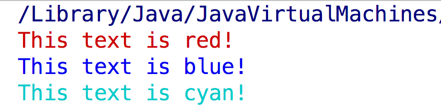

## 如何在控制台中打印彩色字体，你的思路是？




---


这个知识点有点偏，根据ANSI转义序列的规则，如果一个字符串以某些特殊的字符开头，那么控制台(命令行)就会做出一些特殊的反应，比如移动光标、改变字体颜色。

```java
public class ColorPrinter {
    public static final String ANSI_RESET = "\u001B[0m";
    public static final String ANSI_BLACK = "\u001B[30m";
    public static final String ANSI_RED = "\u001B[31m";
    public static final String ANSI_GREEN = "\u001B[32m";
    public static final String ANSI_YELLOW = "\u001B[33m";
    public static final String ANSI_BLUE = "\u001B[34m";
    public static final String ANSI_PURPLE = "\u001B[35m";
    public static final String ANSI_CYAN = "\u001B[36m";
    public static final String ANSI_WHITE = "\u001B[37m";
}
```

```java
    @Test
    public void print(){
        System.out.println(ColorPrinter.ANSI_RED + "This text is red!"
                + ColorPrinter.ANSI_RESET);

        System.out.println(ColorPrinter.ANSI_BLUE + "This text is blue!"
                + ColorPrinter.ANSI_RESET);
        System.out.println(ColorPrinter.ANSI_CYAN + "This text is cyan!"
                + ColorPrinter.ANSI_RESET);
    }
```

(window系统以及部分shell不生效)